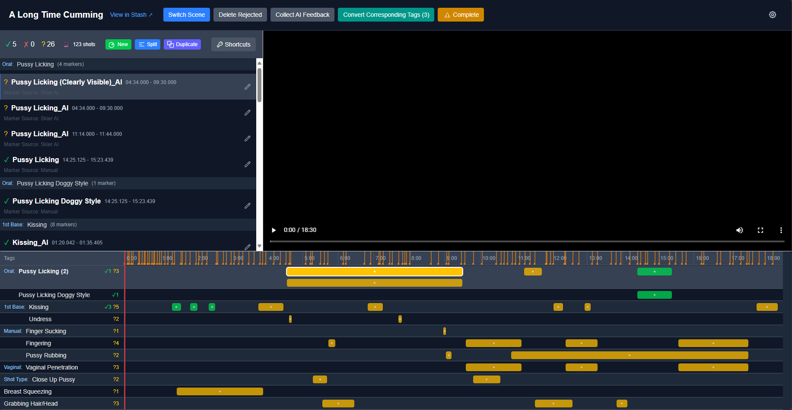

# Stash Marker Studio



Stash Marker Studio is a companion app for Stashapp and makes working with markers and tags much easier. It was mainly designed to support using [Skier's NSFW AI model](https://github.com/skier233/nsfw_ai_model_server) but it works with any markers.

To reliably use tools like Skier's NSFW AI model or marker sources such as TPDB or timestamp.trade, there needs to be some kind of review. The opinionated approach of Stash Marker Studio is as follows:

- Markers always have a single, actual tag stored as primary tag.
- Additional tags of markers are used only for metadata such as is the marker confirmed or rejected or what is the source for that marker.
- When a scene is reviewed, user will confirm or reject the markers on the scene. Rejected markers can be easily deleted.
- After review is completed, all AI tags of a scene and its markers will be removed and only the tags from the confirmed markers will be saved. Tags which were previously present on a scene and did not originate from any of the markers will not be touched.

Stash Marker Studio also optionally supports PySceneDetect which will analyze the video stream, detect shot boundaries and use those for easier navigating when reviewing and finetuning the markers.

## Getting Started

1. Clone the repository
2. Copy the `.env.sample` file to `.env.local` and update the values according to your Stashapp instance configuration.
3. Build the Docker image:

```bash
docker build -t stash-marker-studio .
```

4. Run the Docker image:

```bash
docker run -p 3000:3000 --env-file .env.local stash-marker-studio
```

5. Open [http://localhost:3000](http://localhost:3000)

## Development

This project uses:

- Next.js 15 with App Router
- TypeScript for type safety
- Tailwind CSS for styling
- GraphQL for API communication
