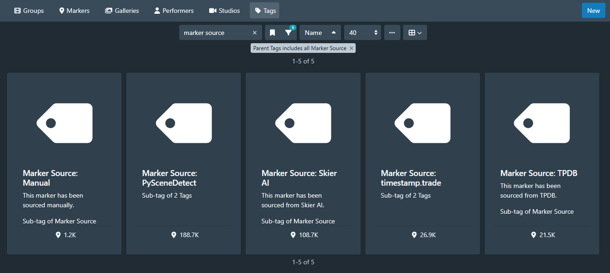
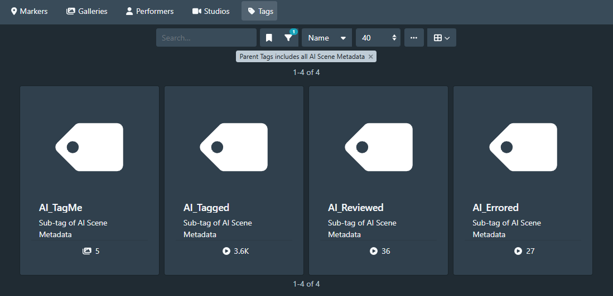
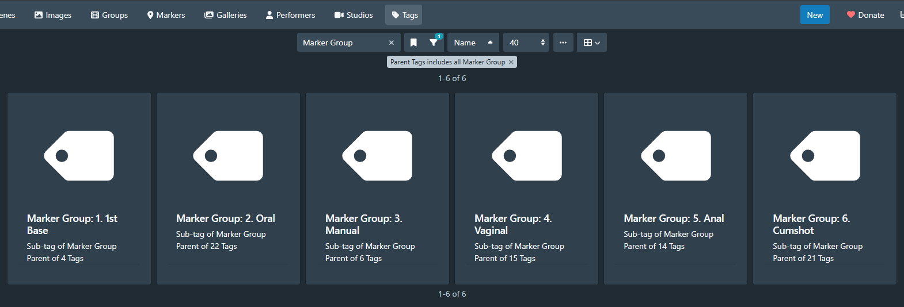

# Stash Marker Studio


Stash Marker Studio is a companion app for Stashapp and makes working with markers and tags much easier. It was mainly designed to support using [Skier's NSFW AI model](https://github.com/skier233/nsfw_ai_model_server) but it works with any markers.

To reliably use tools like Skier's NSFW AI model or marker sources such as TPDB or timestamp.trade, there needs to be some kind of review. The opinionated approach of Stash Marker Studio is as follows:

- Markers always have a single, actual tag stored as primary tag.
- Additional tags of markers are used only for metadata such as is the marker confirmed or rejected or what is the source for that marker.
- When a scene is reviewed, user will confirm or reject the markers on the scene. Rejected markers can be easily deleted.
- After review is completed, all AI tags of a scene and its markers will be removed and only the tags from the confirmed markers will be saved. Tags which were previously present on a scene and did not originate from any of the markers will not be touched.

Stash Marker Studio also optionally supports PySceneDetect which will analyze the video stream, detect shot boundaries and use those for easier navigating when reviewing and finetuning the markers.

Stash Marker Studio is heavily centered around keyboard use and many functionalities are only available using those. You can click on i icon to see the full list. The guiding principle is that left hand is used for modifying actions and right hand is used for navigating within the scene.


## My current workflow

- New scene is added to Stashapp
- Scene is matched with Tagger feature in Stashapp
- AI_TagMe tag is set to scene and Skier's AI model is applied to it
- PySceneDetect script is run to analyze scene to get shot boundaries
- I start manual marker review and confirm or reject the markers
- I use Stash Marker Studio to change the AI tags of the markers to their corresponding real tags.
- I mark scene as being reviewed and move to a next scene

Actual tags such as Kissing and Kissing_AI relationship is configured by setting Kissing_AI tag's Description in Stashapp be "Corresponding Tag: Kissing". Stash Marker Studio has "Convert AI Tags" functionality which will convert show these conversions for user confirmation.


## Getting Started

Stash Marker Studio requires Stash version 0.28 or later. 0.28 introduced support for start and end times for markers which is crucial for the tool.

1. Clone the repository
2. Copy the `.env.sample` file to `.env.local` and update the values according to your Stashapp instance configuration.
3. Build the Docker image:

```bash
docker build -t stash-marker-studio .
```

4. Run the Docker image:

```bash
docker run -p 3000:3000 --env-file .env.local stash-marker-studio
```

5. Open [http://localhost:3000](http://localhost:3000)

For `pyscenedetect-process.js`, please run:

```bash
npm install
node src/scripts/pyscenedetect-process.js
```

### Detailed configuration

These are the environment variables in the env file:

- STASH_URL: Your Stash URL, most likely http://localhost:9999
- STASH_API_KEY: Your API key found in Settings -> Security

Following items are IDs of tags you need to create. Naming is up to but example names are shown for demonstration purposes.



- MARKER_STATUS_CONFIRMED: Assigned to confirmed markers permanently. Example name: "Marker Status: Confirmed"
- MARKER_STATUS_REJECTED: Assigned to rejected markers until they are deleted. Example name: "Marker Status: Rejected"
- MARKER_SOURCE_MANUAL: Assigned to markers created in Stash Marker Studio manually. Example name: "Marker Source: Manual"



- MARKER_AI_REVIEWED: Set to the scene after the markers have been reviewed. Example name: "AI_Reviewed". This follows the default pattern of Skier's tags where scenes are tagged with AI_TagMe or AI_Tagged.



Optionally you can group different tags using Marker Groups so those swimlanes on Stash Marker Studio timeline are grouped together. This is achieved by creating a tag hierarchy on Stashapp like this:

- Marker Group - _This is parent tag for all Marker Groups and which ID you need to set to MARKER_GROUP_PARENT_ID_
  - Marker Group: 1. 1st Base - _This is a child of Marker Group but parent for actual Stashapp tags_
    - Kissing - _Actual Stashapp tag_
    - ...
  - Marker Group: 2. Oral
  - ...

As mentioned above, you can also additionally use PySceneDetect for shot boundary detection. That requires its own tags which IDs you need to set to following environment variables:

- MARKER_SHOT_BOUNDARY=300002: Assigned to markers created by PySceneDetect as a primary tag. Example name: "Video Cut"
- MARKER_SOURCE_PYSCENEDETECT: Assigned to markers created by PySceneDetect to indicate marker source. Example name: "Marker Source: PySceneDetect"
- MARKER_AI_TAGGED: Created by Skier's AI model. This is used to find models which are already AI tagged and need to be processed with PySceneDetect before the scene is ready for proper review. Example name: "AI_Tagged"
- MARKER_PYSCENE_PROCESSED: Assigned to scenes processed with PySceneDetect. Example name: "Scenes: PySceneDetect: Processed"

## Development

This project uses:

- Next.js 15 with App Router
- TypeScript for type safety
- Tailwind CSS for styling
- GraphQL for API communication
